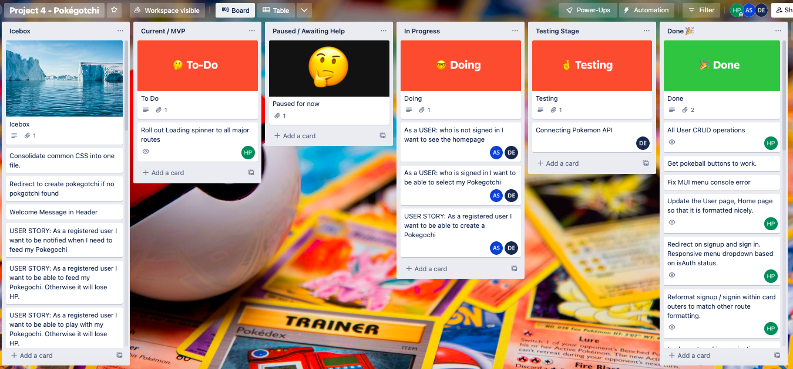
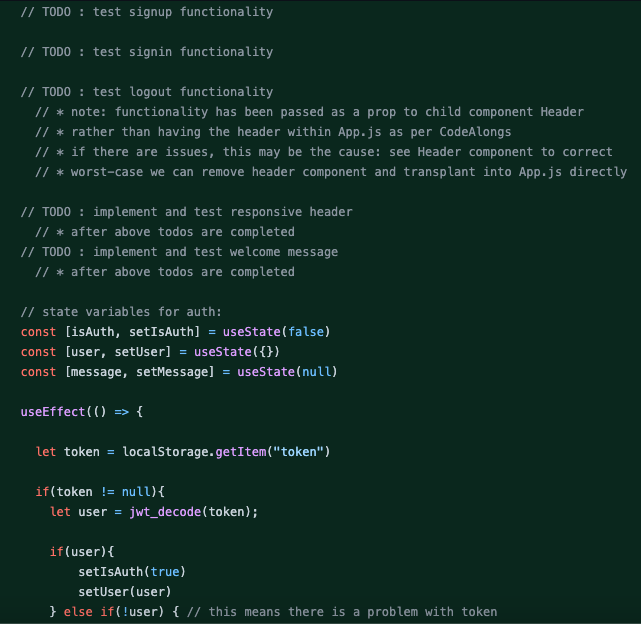
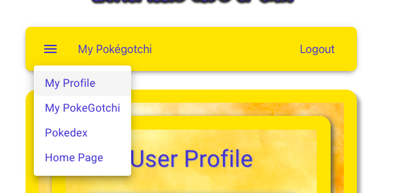

<p align="center">
    
</p>

# Pokégotchi : SEI Project 4        

## Description:     

This is a MERN stack web application - _Pokégotchi_ - built as group of three ([Ashish](https://github.com/EHCarr) (Team Leader), [Dan](https://github.com/Emsley1d) and I) in a timescale of one week, using linked frontend and backend applications: a Node.js backend, with Express framework and an Atlas hosted MongoDB database, linked to a React-based frontend application. This was Project 4 - the 'capstone' project - completed as part of General Assembly London's Software Engineering Immersive course. We presented a deployed version to my Instructional Team and fellow SEI cohort on 26/08/22.            

      

This web app is a crossover between Tamagotchi and Pokémon, where users can select a Pokémon and then look after them: for example by healing them if injured in battle, or feeding them if they are hungry after not being fed for a while. The frontend app makes use of React's Single Page Application capability, meaning that the UI can render and update without the need for navigating between pages.     

I focused primarily on the frontend of the application, creating and styling all components with the exception of `Pokedex.js` and `Choice.js`. This includes signup/sign in, frontend authentication, `User` CRUD operations, the Pokégotchi card and overall main App UI/UX. I also worked on the backend `User` APIs as well as some further backend APIs and functionality.        

## Links:       
[Deployment link](https://project04pokegotchi.herokuapp.com/)       
<!-- TODO : fix or redeploy app so that this link works... -->
[Google Doc README](https://docs.google.com/document/d/1t7EvTLFPsIKQwhfXQDHanu9GjoIeijHyInz7E7FQvCA/edit?usp=share_link)            

[Frontend GitHub Repository](https://github.com/hphilpotts/Pokegotchi-Frontend-Project-4-General-Assembly-SEI-66/tree/harrydev/src/pokegotchi) | [Backend GitHub Repository](https://github.com/hphilpotts/Pokegotchi-Backend-Project-4-General-Assembly-SEI-66)     

## Getting started & Install:     

To get started, please feel free to sign in as: Test29@test.com // pw: London29 - or sign up (your real email is not required!).       

To contribute, please fork and clone the Frontend and Backend repositories respectively as above, running `npm install` in each repository in order to install required dependencies. Alternatively, please see each `package.json` for a list of required dependencies.         

Please submit pull requests for any completed contributions.        

## Technologies used:       

### Frontend:             
- React Library: JSX, CSS, JavaScript            
- Axios     
- MUI styling       
- React Router DOM routes, JWT authentication       

### Backend:        
- Node.js runtime environment, Express framework
- JavaScript, jQuery, Mongoose, Axios               
- Atlas hosted MongoDB database, MongoDB Compass GUI          
- bcrypt, body-parser, jsonwebtoken, passport dependencies        

### Project:        
- Trello project board      
- Lucidchart ERD        
- Figma wireframes      
- Postman API testing       

       

## Brief & Project aims:       
The brief for this project was to use our knowledge of React combined with all earlier learning to build a full stack (MERN) web application (comprising linked frontend and backend applications), either solo or as a group, within the timescale of one week. This was our 'capstone' project: our most advanced project to date and the culmination of our learning from the previous 11 weeks.        

Technical requirements included:             
- Complete full planning for the project: Trello board, wireframes, an ERD.            
- Use professional-standard version control to manage contributions as a team.      
- Incorporate the technologies of the MERN-stack, using AJAX to communicate between the React frontend and Express backend.     
- Include a well-styled, interactive Single Page Application frontend.      
- Implement token-based authentication, include sign up, sign in and sign out.      
- Include authorisation by restricting CUD functionality to authenticated users.        

Guidelines around self-sufficiency included:        
- Use all resources available to solve the issue on your own before seeking assistance.     
- If you do seek assistance in Slack, explain the issue as clearly and detailed as you can, include screenshots when possible, and be prepared to explain what you've done to solve the issue on your own.      
       
The aim of this project was to bring together everything we had learned through the course, and apply it in a comparatively complex MERN app. The self-sufficiency guidance was of particular importance, simulating a learning environment which was closer to a professional coding environment than we had seen before; this would push us harder to think on our own feet, relying on documentation, research and trial and error problem solving.

The requirement to use React would challenge and consolidate our understanding of the key concepts for using the React library, for example: the Component life cycle, Single Page Applications and the use of React Functional Components compared with React Class-based Components.            

## Key takeaways and learnings:       
My number one takeaway from this: React is tough. Number two though: React is powerful, sleek and fast; it is great fun to work with and rewarding when you get things working. I'm very glad we covered React as the last part of the course: I think if we had looked at it sooner I would have been put off, rather than emerging the other side feeling excited about the prospect of working with it again. I came out of this project a much better - and indeed much more confident - React developer than when I went in and I am so thankful that I opted to work primarily on the frontend, as it really changed my perception of working with React. To have worked only on the backend would have meant missing out on this!		       

I enjoyed this project tremendously from start to finish (yes - even when things were not working or just plain going wrong!). It represented the moment where I turned a corner not just in terms of React, but also in so many other aspects. CSS finally 'clicked' for me, communication between frontend and backend suddenly became so much clearer, APIs stopped being quite so mysterious. I loved going back to the Express framework again (it felt like an 'old friend' after 21 full-on days of Python & Django). Most importantly, I finally learned to value error messages: they're nothing to get annoyed or down about, they're literally just there to tell you what went wrong - in short, they're there to help you!       

Our finished product is still rough around the edges and by not yet where I'd wanted or hoped for it to be, but the journey getting there is the important thing. I'm still proud to show off the app, but prouder still to show off the code that I had written. Lastly, I'm glad that I took the opportunity to work with two great developers rather than working solo as I had initially intended: this project really was a fantastic (albeit very intense!) way to finish off the course.        

## Successes and Challenges:         
Aside from the learning and takeaways above, some key successes were:     

        
_console.log()s in action!_     

- Fully appreciating that `console.log()`s are (along with error messages) your best friend, and the best way of pinpointing what is happening where.       
- Using and getting to grips with _MUI_: whilst complicated at points, it is a powerful tool for styling React apps and a useful library to have experience with.     
- Delivering a finished UI that aligned closely with the wireframe we had come up with. This simulated working to a brief (where in the past I might have had more creative leeway - and as such a more freeform approach to styling 'on the fly') which was again an important bit of experience.     
- Implementing code that would automatically change database values in the background for as long as the server is running: this required getting into and understanding Mongoose and its documentation, as well as my first 'live' project-environment use of recursive functions. One of those moments where I was quietly(ish) shocked when the code actually worked!        
- Overcoming synchronicity issues through using Session Storage: this was a solution that I came to organically, I was concerned it was a 'bodge' rather than a fix but was pleasantly surprised to find out that it was a quite standard approach.     
- Achieving (near) mobile responsiveness through a 'mobile-first' approach: this of course created additional work, but is something I am motivated to deliver and believe results in a better end product.     
- Navigating Git version control (pretty much) seamlessly. This was all thanks to learning and experience from previous projects and a more methodical approach - and crucially made for quite a nice change from the turbulent git merge conflicts seen before.     

Challenges faced included:      
- Delivering a finished project in the timeframe allowed. The presentation day was moved forward from a Monday to the Friday before, when combined with a perhaps overly-ambitious project and some delays in getting complex third-party APIs to work this meant that we handed in a project that did not have the scope we had hoped for when planning.     
- Synchronising workload and avoiding overlap: at times there was some crossover and duplication, particularly where individual work continued 'out of hours'. We generally were able to manage this well through comments in the code, slack updates and catch ups at the start and end of each day.     
- Fully understanding the role of `useEffect`: React Functional Components were only introduced to us a few days before starting the project, as such this RFC lifecycle proved a very steep learning curve. Similarly the use of dependencies with `useEffect`: this only really 'clicked' for me after the project was over when going through my code with a friend!                  
- Also, fully understanding 'asynchronous' as opposed to 'synchronous' programming: in particular how and when `async` should be used.      
- Inadvertent loss of data when backend changes were made: I wasn't sure why my frontend had started misbehaving until I eventually went and checked the Compass GUI...               
- React itself! Whilst very powerful and great fun to work with, it can be particularly 'picky' and often simply stops running (_of course this is great when it is preventing infinite loops_!), errors can come thick and fast, and VSCode sometimes struggles. A steep learning curve but one well worth overcoming!        

## Bugs & Issues:       
- Heroku-hosted version of the App does not currently work.         
- 'Select Pokégotchi' for new users is not working: instead this requires Pokégotchi to be manually inserted into the database.      
- Alert messages not yet implemented. For example: a failed sign in is not obvious to the user.        
- Status values can drop below 0 which then prevents any incrementation through User action.     
- There is some text overlap to the bottom of the `Card.js` component on certain screens.        
- Auth form text box outline overlaps text box title text.      

## Future Improvements:     
- Implement fixes to the above: especially 'select Pokégotchi' and status value bug.        
- Add the ability to change Pokégotchi.     
- Include User-User interaction, for example, battles between Pokégotchi.       
- Add background to `App.js` - potentially a dynamically changing one based upon Pokégotchi and/or actions taken.       
- Include animation upon user actions, particularly when interacting with Pokégotchi.       
- Refactoring required, especially in Card.js and its child components, and many comments / commented-out code sections need removing.      

## Production Process:     

### 20/10/22 | Day 0 | Brief issued, Planning, Setup:                  
Immediately after being given the project brief, we were placed into individual breakout rooms on _Zoom_ and given the option of forming groups or, if preferred, working solo for the project. I joined up with Ashish and Dan as they were looking for a third group member and I had yet to work with them on a project. We decided that Ashish would be project lead as he had not yet had experience of this.      

After initial discussion we settled on an idea and I put together a Trello board:     

        

Before jointly creating wireframes with Dan:     

             

And finally an ERD was added by Ashish:     

         

We decided to split ownership, with Dan and Ashish working primarily on the backend - Ashish focusing in particular on app setup, authentication, and backend APIS, Dan focusing on 3rd Party API integration and further backend APIs - and I was to work primarily on the Frontend, owning UI/UX, and frontend auth, CRUD functions and backend API integration.      

At times we would cross over from frontend to backend and vice versa when this made sense from a continuity perspective: for example, Dan added the 3rd Party API based Pokedex components in the frontend and I added Pokégotchi-based APIs in the backend.        


Lastly: Git repositories were set up along with React and Express app setup on the front- and back-end respectively, and MongoDB database set up - all ready for the next day.    

### 21/10/22 | Day 1 | Production:                  
Ashish and Dan started work on the backend whilst I started on the Frontend, first by installing _MUI_ and then adding logo and header components.      

     

I then worked on building the overall component structure and layout, focusing early on on mobile-optimisation (_which MUI is great for_!), and then implementing the `Card.js` component.      

     

Lastly, I added routes/forms for signup and sign in, a 'confirm password' box, before preparing the front-end in readiness for JWT auth from the backend.       

      
_Frontend prepared for JWT auth from backend, notes for self and backend devs if work continues over the weekend added in comments_        

### 24/10/22 | Day 2 | Production:                  

On the frontend, I worked on passing `userId` to the `Card` component, loading Pokégotchi images based on Pokedex number from the database, and general formatting. 

This work included a fix using Session Storage where props (notably `userId` and `pG` for User and Pokégotchi respectively) were being lost on manual refresh:        

       
_App.js useEffect sets userId in Session Storage_       

      
_findPG runs within useEffect, sets pG in Session Storage_

     
_Card.js retrieves pG from Session Storage_     

On the backend, I worked on cleaning up some stray code that was causing issues, and wrote an first version of a GET Pokégotchi by User Id API:     

```
// GET Pokegotchi by User Id
exports.pokegotchi_byUserId_get = (req, res) => {
    console.log("passed in: " + req.query.id)
    // Pokegotchi.find({ name: req.query.id}) // * works in postman when key:id value:Testmon is passed in as Query Param
    Pokegotchi.find({ User: req.query.id }) // ! ...does not work any which way.
    .then(pokegotchi => {
        console.log(pokegotchi)
        res.json({pokegotchi})
    })
    .catch(err => {
        console.log(err)
    })
}
```

Later fixed as:     

      
_The final (working!) version of the GET Pokégotchi by User Id API_     

### 25/10/22 | Day 3 | Production:                  

I spent the first part of today working on styling and formatting, rolling out more consistent visuals across components, including use of `Template.js` for future use:        

     

I then moved onto User READ operations, writing backend APIs and testing in Postman:     

     
_GET User detail API from controllers/users.js_     

Before then implementing in the frontend:       

       
_Retrieving User Detail in User.js frontend component_      

In `User.js` I was finding that props were not loading fast enough for the component to render correctly, I bypassed this by adding a `setTimeout` to `useEffect`, and then a loading spinner if the `isLoading` state is true:     

      
_User.js useEffect with 1.5 timer_      

        
_CircularProgress renders if (isLoading)_       

I then moved onto writing APIs for the remaining User CRUD operations in the backend.      

I also implemented a 'logged-in responsive' MUI-based dropdown menu in the header:     

        

     
_props.isAuth determines which menu loads - requires two menus rather than one menu that holds different MenuItems_     

### 26/10/22 | Day 4 | Production:                  

Today I looked at authentication, signup and sign in on the frontend, as well as working on tidying up the UI and improving mobile responsiveness. I then moved onto implementing the remainder of User CRUD operations in the frontend:        

        
_READ User component_       

        
_EDIT User component_       

        
_DELETE User component with confirmation dialogue from MUI_     

My work on the backend today was spent ironing out issues with my APIs, which required a somewhat clumsy fix within `models/Pokegotchi.js` where `user: [{ type: mongoose.Schema.Types.ObjectId, ref: 'User' }]` was changed to `type: mongoose.Schema.Types.Mixed`.        

### 27/10/22 | Day 5 | Production:                  

For the final day before the deadline, I worked on hunting bugs across the frontend, added a 404 page and worked further on styling across the app.     

I also implemented interactions with the Pokégotchi, adding working buttons, a changing status message, and status update values:        

      
_The card with working buttons: messages and status update upon interaction_        

       
_Code from Buttons.js_      

       
_Switch statement - needs refactoring - that handles button press in Card.js_       

       
_Example functions for clean and feed - again, needs refactoring!_      

In the backend, I worked on automatically decrementing Pokégotchi status levels in the background whilst the server is running. This was my favourite bit of code for the project and a great way to finish!        

After poring over a lot of Mongoose documentation (which I must admit I find harder than lots of other documentations), I eventually came up with the following API in `controllers/pokegotchi.js`:         

        
_PUT API: works using an updateMany, set with no filter to target all Pokégotchi documents, which then increments multiple properties by -1_        

I then wrote the following in `server.js` to execute an Axios request using the above API, within timed recursive functions. One of those moments where I was shocked it actually worked!       

     
_Functions called recursively on 2hr timeout, this runs in the background as long as the server is running!_     

### 28/10/22 | Day 6 | Presentation:                

As with Project 3, I made a few slides showing key bits of code for the presentation. We had multiple deployment issues but were able to run a working version for the presentation.        

We were given some great feedback and I especially enjoyed demonstrating how my recursive server functions worked to the rest of our cohort!         

There were - and are - lots of bits that need improving or adding, but we were all rightly pleased with what we had produced. And, more importantly, we had fun and learned a huge amount in completing the project! A great way to end the course!             


       
_Our Pokégotchi app 404 page!_          
---